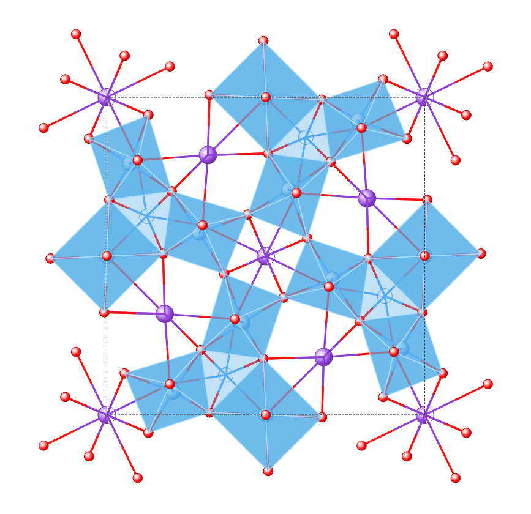
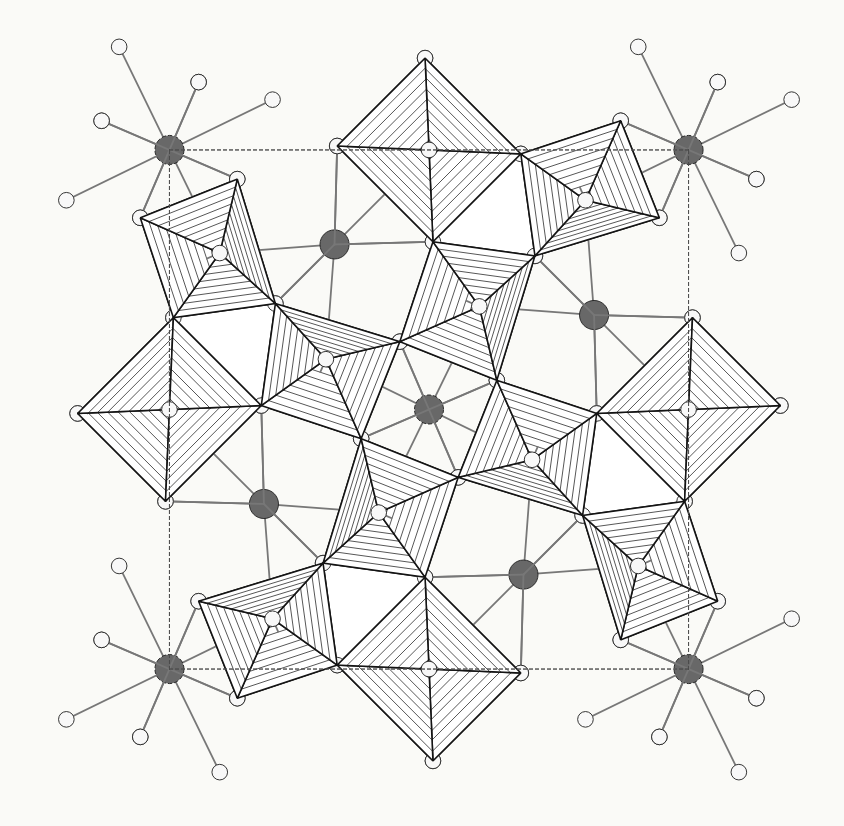

# unit-cell-gui

`unit-cell-gui` is a reusable PySide6 widget that draws complete unit-cell
scenes supplied by another program. It does not read CIF files, expand
symmetry, resolve atomic positions, infer bonds, construct polyhedra or
calculate diffraction.

The caller supplies ready Cartesian coordinates and presentation data:

- atoms and their styled occupancy components;
- bond indices;
- unit-cell vertices and edges;
- three basis vectors;
- optional polyhedron vertices, polygon faces and centres.

The package owns only display behaviour: camera projection, depth sorting,
left-button rotation, right-button panning, wheel zoom, occupancy sectors,
colour and black-and-white drawing, and polyhedron hatching. Quadrilateral
hatching uses one intact polygon with `2x + 1` full parallel strokes. Hatch
directions on farther faces are refolded through real shared edges.

<table>
  <tr>
    <td align="center" width="50%">
      
      <br>
      <sub>Normal view</sub>
    </td>
    <td align="center" width="50%">
      
      <br>
      <sub>Hatched view</sub>
    </td>
  </tr>
</table>

## Installation

```bash
python -m pip install unit-cell-gui
```

Python 3.10 or newer, NumPy and PySide6 Essentials are required.

## Basic use

```python
import numpy as np
from PySide6.QtWidgets import QApplication
from unit_cell_gui import Atom, AtomComponent, DisplayOptions, Scene, UnitCellViewer

silicon = AtomComponent(
    key="Si:Si1", label="Si1", element="Si",
    occupancy=1.0, colour="#f0c8a0", radius=0.30,
)
scene = Scene(
    atoms=(Atom("Si:Si1", "Si1", (silicon,)),),
    atom_centers=np.array([[0.0, 0.0, 0.0]]),
    bonds=np.empty((0, 2), dtype=int),
    cell_vertices=np.array([
        [x, y, z]
        for x in (-1.0, 1.0)
        for y in (-1.0, 1.0)
        for z in (-1.0, 1.0)
    ]),
    cell_edges=np.array([
        [0, 1], [0, 2], [0, 4], [1, 3], [1, 5], [2, 3],
        [2, 6], [3, 7], [4, 5], [4, 6], [5, 7], [6, 7],
    ]),
    basis_vectors=np.eye(3),
    base_radius=2.0,
)

app = QApplication([])
viewer = UnitCellViewer()
viewer.set_scene(scene)
viewer.set_display_options(DisplayOptions(show_polyhedra=False))
viewer.show()
app.exec()
```

`Scene` copies its arrays and makes them read-only. Later changes in the caller
therefore cannot alter an already submitted scene.

## Orientation synchronization

`orientation` is a 3 by 3 world-to-camera matrix. For column vectors the
camera coordinate is `orientation @ world`; the renderer's row arrays use the
equivalent `world @ orientation.T`.

Programmatic changes are silent by default:

```python
viewer.set_orientation(matrix, emit=False)
```

Interactive rotation emits the complete new matrix through
`orientation_changed`. Connect that signal to a pole figure or another view,
then send changes from the other view back with silent `set_orientation` calls.
This supports bidirectional synchronization without a signal loop.

```python
viewer.orientation_changed.connect(update_other_view)
other_view.orientation_changed.connect(
    lambda matrix: viewer.set_orientation(matrix, emit=False)
)
```

Set `rotation_enabled=False` when an application temporarily forbids left-button
rotation. Panning and zoom remain available. Polyhedra are hidden by default
and must be enabled with `show_polyhedra=True`.

Per-position colours, visibility and opaque-polyhedron selections are replaced
atomically with `viewer.set_style_overrides(StyleOverrides(...))`. The widget
copies these mappings, so the host can keep its own independent UI state.

## How to cite

If you use `unit-cell-gui` in academic work, please cite the Zenodo record:

[](https://doi.org/10.5281/zenodo.22714947)

You can also use the metadata provided in [`CITATION.cff`](CITATION.cff).
